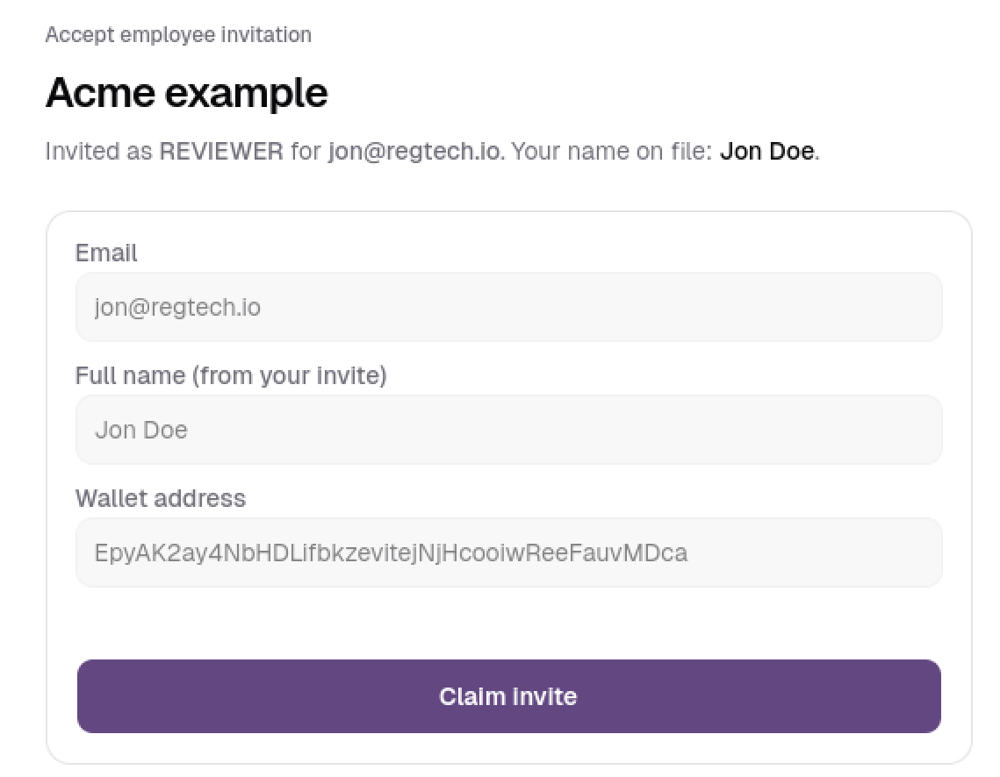
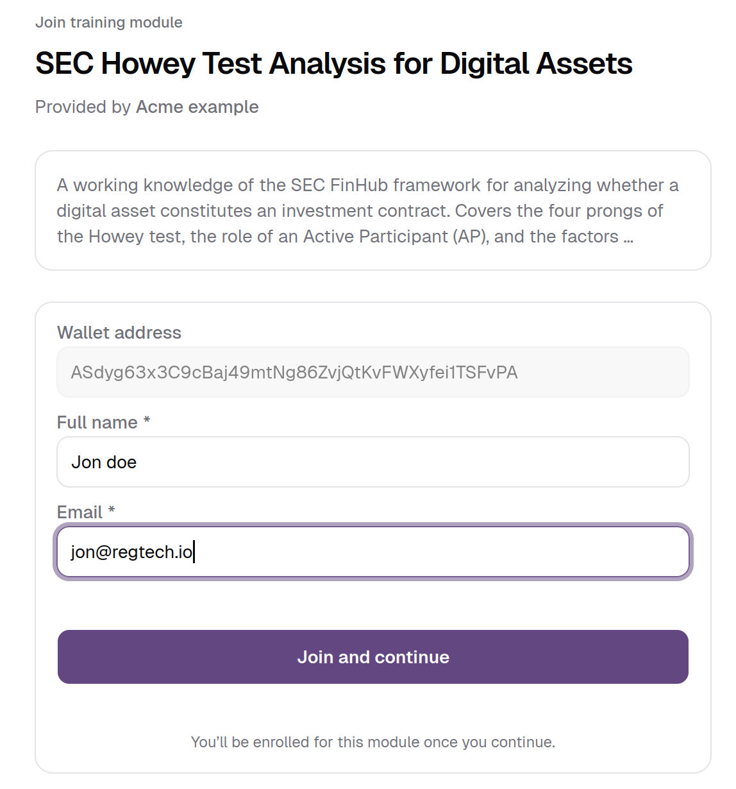
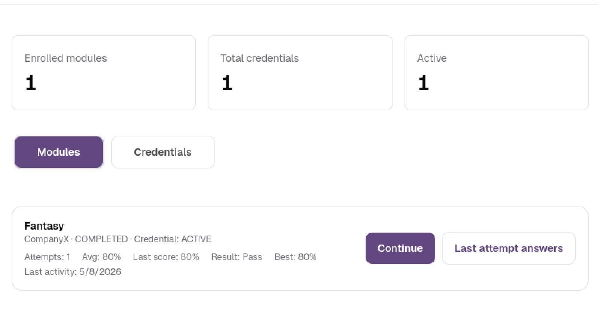
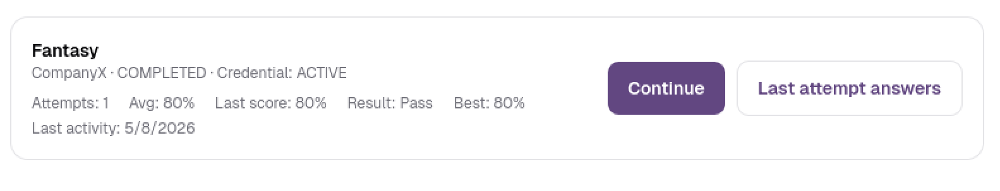
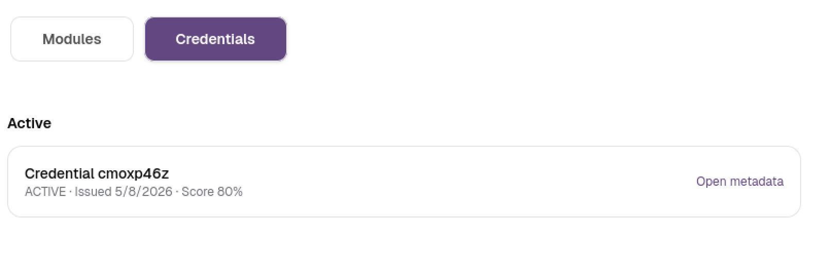
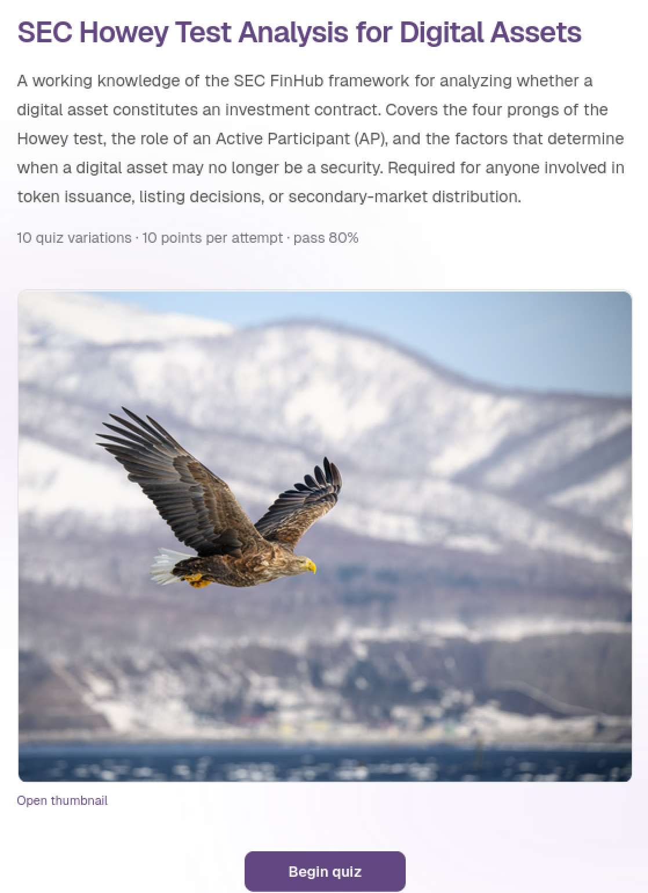
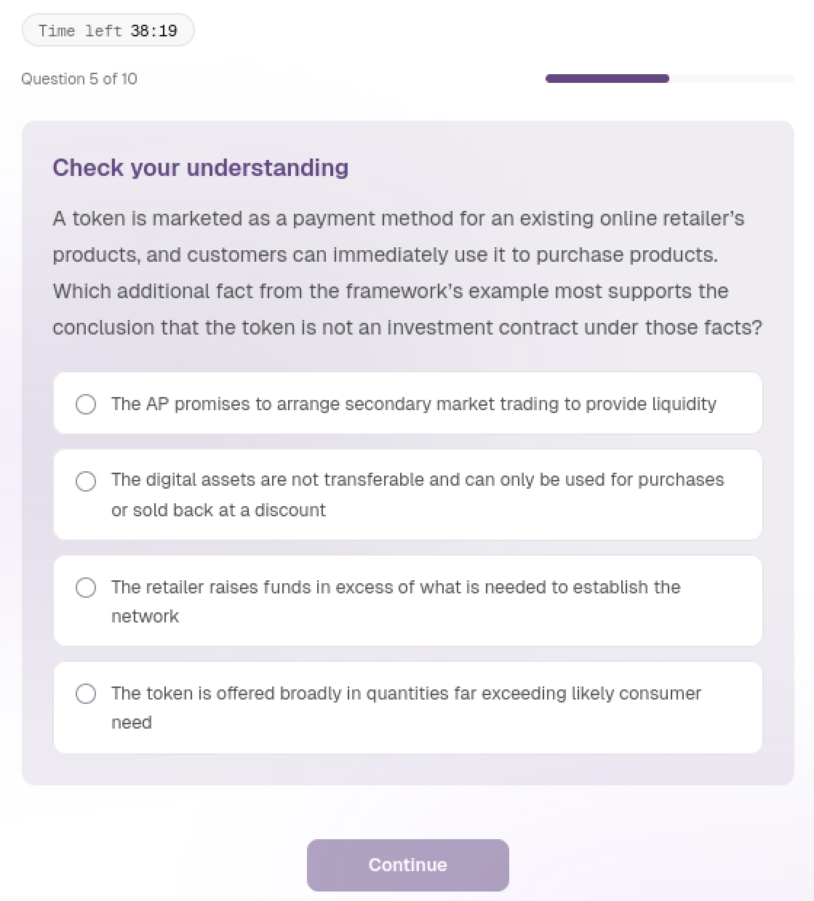
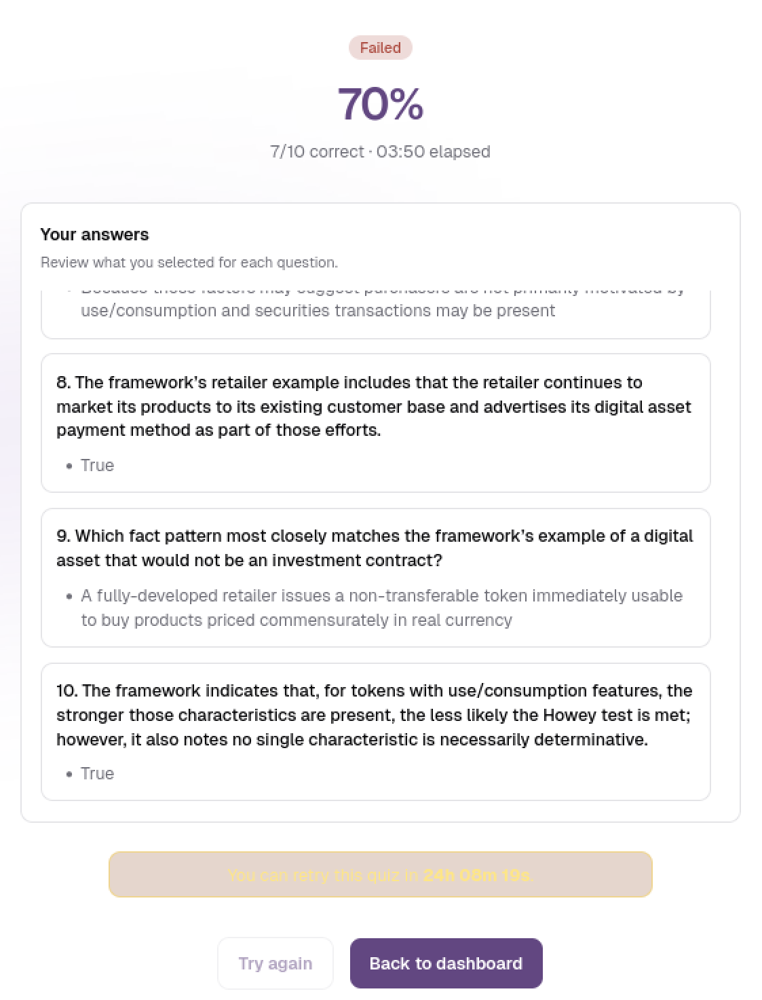

# Employee and Investor Documentation

**RegTech Credential Platform**

A practical guide to joining the platform, completing compliance modules, and earning blockchain-verified credentials.

---

**Version:** 1.0
**Audience:** Employees and Investors
**Network:** Solana Devnet

---

## Contents

1. [How employees and investors differ](#01-how-employees-and-investors-differ)
2. [Before you begin](#02-before-you-begin)
3. [Joining the platform](#03-joining-the-platform)
4. [Signing in later](#04-signing-in-later)
5. [Your dashboard](#05-your-dashboard)
6. [Taking a module](#06-taking-a-module)
7. [If you passed](#07-if-you-passed)
8. [If you failed](#08-if-you-failed)
9. [Your credentials](#09-your-credentials)
10. [Frequently asked questions](#10-frequently-asked-questions)
11. [Quick reference](#11-quick-reference)

---

## 01 How employees and investors differ

Both employees and investors complete the same types of modules and earn the same credentials. The difference is in how you get started:

| | Employee | Investor |
| --- | --- | --- |
| **How you join** | Your employer sends you an invite link | A company shares a module link with you |
| **What you see** | All modules assigned by your company | The specific module(s) you joined |
| **Organization** | You belong to the company | You're independent, not tied to any company |

> **Good to know**
> Each account can only have one role. If you already use your Google account as a company owner, you'll need a different Google account to join as an employee or investor.

---

## 02 Before you begin

You'll need very little to get started:

- A **Google account**. That's all. The platform creates a secure wallet for you automatically.
- An **invite link** if you're an employee, or a **module share link** if you're an investor. The company you'll be working with provides this.

---

## 03 Joining the platform

How you join depends on whether you're an employee or an investor. Both flows take less than a minute.

### As an employee

Your company's owner will send you an invite link. Here's what to expect.

1. Open the invite link in your browser. You'll see your company's name, the role you've been assigned, and the email you were invited with.
2. Click **Connect wallet (Google) to continue** and sign in with your Google account.
3. Check your details. Your email is already filled in. If your name wasn't pre-filled by your employer, type it in.
4. Click **Claim invite**.



That's it. You'll be taken to your dashboard where you can see your assigned modules.

> **If something goes wrong**
>
> - **"This invite has expired. Ask your owner to resend an invitation."** Ask your employer to send a new invite.
> - **"This invite has already been claimed."** Someone else may have used this link. Ask your employer to create a fresh one.

### As an investor

You'll receive a module link from a company. No prior relationship or invite is needed.

1. Open the module link in your browser. You'll see the module name, the company providing it, and a short description.
2. Click **Connect wallet (Google) to continue**.
3. Enter your name and email.
4. Click **Join and continue**.



You'll be enrolled in the module and can start right away.

> **One link per module**
> Each link is for one specific module. If you need to complete multiple modules, the company will share a separate link for each.

---

## 04 Signing in later

After your first time, you can return any time:

1. Go to the main page and click **Get Started**.
2. Choose **Continue with Google (wallet)**.
3. Sign in with the **same Google account** you used when you first joined.

You'll be taken straight to your dashboard.

> **Use the same Google account every time**
> Your account, your enrolled modules, and your credentials are all tied to the Google account you signed up with. If you sign in with a different account, you'll be treated as a new user with no history.

---

## 05 Your dashboard

Your dashboard is your home base. It shows everything at a glance.



### Overview

At the top, you'll see three numbers:

| Number | What it shows |
| --- | --- |
| Enrolled modules | How many modules you're part of. |
| Total credentials | All credentials you've earned. |
| Active | Credentials that are currently valid. |

### Modules tab

This is your main workspace. Each module shows:

- The module name and which company it's from.
- Your current status: **Pending** (not started), **In Progress**, **Completed**, or **Failed**.
- Your stats: number of attempts, average score, best score, last score, pass/fail result, and when you last worked on it.



You'll see two buttons for each module:

- **Continue.** Jump into the module.
- **Last attempt answers.** Review what you answered last time.

### Credentials tab

All your earned credentials, organized by status:

| Status | What it means |
| --- | --- |
| Active | Valid and verifiable on the blockchain. |
| Expired | Past their expiration date. |
| Revoked | Withdrawn by the issuing company. |

Each credential shows its ID, status, issue date, score, and a link to view the full details.



---

## 06 Taking a module

Modules are compliance assessments with a quiz you need to pass to earn a credential. Here's what the experience looks like.

### Step 1: Review the intro

When you open a module, you'll see:

- The module name, description, and thumbnail.
- Key details about the quiz: how many variations there are, points per attempt, and the passing score you need to hit.



When you're ready, click **Begin quiz**.

> **Cooldown after a failed attempt**
> If you've previously failed and there's a cooldown period active, you'll see a countdown timer. The quiz button becomes available once the timer runs out.

### Step 2: Answer the questions

- Questions appear **one at a time**, with a progress bar showing where you are (e.g. "Question 3 of 15").
- Read each question carefully and select your answer. Your selected option will be highlighted in blue.
- Click **Continue** to move to the next question, or **Submit** on the final question.
- If there's a time limit, you'll see a countdown in the top-right corner. It turns red when you're down to 30 seconds. The quiz submits automatically when time runs out.



> **You can't go back**
> Once you've moved past a question, you can't return to it. Take your time on each one before clicking Continue.

### Step 3: See your results

After submitting, you'll immediately see:

- A **Passed** (green) or **Failed** (red) badge.
- Your score as a percentage.
- How many questions you got right.
- How long you took.
- A full review of every question and what you answered.



---

## 07 If you passed

Congratulations. When you pass, a credential is minted on the blockchain as proof of your achievement.

On the results screen you'll see:

- **Credential issued.** With links to view the credential details and verify it on a Solana explorer.
- **Share.** To share your achievement.
- **View credentials.** To go to your credentials tab.

If the credential isn't minted automatically, you'll see a **Claim credential** button. Click it and wait a moment. Your credential will be created.

Click **Back to dashboard** when you're done.

---

## 08 If you failed

Don't worry, you can try again.

On the results screen:

- Review your answers to see which questions you got wrong.
- If there's a cooldown period, a timer will show when you can retry (e.g. "You can retry this quiz in 23h 45m 12s"). The default cooldown is 24 hours, but it depends on how the company configured the module.
- Once the cooldown ends, click **Try again** to start a fresh attempt.

> **Use the wait productively**
> Use the cooldown time to study any learning materials attached to the module. You can also check your previous answers from the dashboard using the **Last attempt answers** button.

---

## 09 Your credentials

When you pass a module, you earn a credential: a blockchain-verified proof of completion. Here's what that means.

### What's in a credential

Each credential records:

- Which module you completed and which company issued it.
- Your score.
- When it was issued.
- A unique on-chain address that anyone can use to verify it.

### Credential statuses

| Status | What it means |
| --- | --- |
| **Active** | Valid and verifiable on the blockchain. |
| **Expired** | Past its expiration date. May need renewal. |
| **Revoked** | Withdrawn by the issuing company (e.g. updated requirements). |

### Sharing and verification

Your credentials are portable. Anyone can verify them by looking up the asset address on a Solana blockchain explorer, with no account on this platform needed. You can share the credential link or asset address with anyone who needs to confirm your compliance status.

> **Verification is public**
> A potential employer, regulator, or auditor can verify your credential independently. They don't need an account on this platform, and they don't need your permission. The blockchain is the source of truth.

---

## 10 Frequently asked questions

### Getting started

**Do I need cryptocurrency or real money?**
No. The platform runs on a test network. Everything, from creating your wallet to minting credentials, is free.

**Do I need to install anything?**
No. When you sign in with Google, a secure wallet is created for you automatically. No browser extensions or crypto knowledge needed.

**Can I be both an employee and an investor?**
Not with the same Google account. Each account has one role. If you need both, use a separate Google account for each.

### Account issues

**I got an invite link, but it says "expired" or "already claimed."**
Ask your employer to send a new one. Expired links can't be reused, and claimed links are one-time-use.

**I signed up with the wrong Google account.**
Your account is tied to the Google account you used when you first joined. Ask the company to create a new invite for your correct account.

**I'm an investor and want to access more modules from the same company.**
Each module has its own link. Ask the company to share the link for each additional module you need.

### Quizzes

**Can I pause a quiz and come back later?**
No. Once you start, you need to finish in one session. If you close your browser or navigate away, your attempt may be lost.

**Is there a time limit?**
It depends on the module. If there is one, you'll see a countdown timer during the quiz. The quiz submits automatically when time runs out.

**How many times can I retake a quiz?**
This depends on how the company configured the module. After a failed attempt, you'll need to wait through the cooldown period before trying again.

### Credentials

**Where is my credential stored?**
On the Solana blockchain, linked to your wallet. You can view it from your dashboard or look it up on any Solana explorer.

**My credential says "Revoked." What happened?**
The issuing company withdrew it, usually because compliance requirements changed. Contact the company for details.

**Can I share my credential?**
Yes. Share the asset address or metadata link. Anyone can verify it independently on the blockchain.

---

## 11 Quick reference

### As an employee

```
1.  Open    >  Open invite link from your employer
2.  Sign in >  Continue with Google (wallet)
3.  Confirm >  Check your details, click Claim invite
4.  Open    >  Dashboard > pick a module > Begin quiz
5.  Earn    >  Pass the quiz to earn a credential
```

### As an investor

```
1.  Open    >  Open module link from a company
2.  Sign in >  Continue with Google (wallet)
3.  Join    >  Enter name and email, click Join and continue
4.  Start   >  Review the module intro, click Begin quiz
5.  Earn    >  Pass the quiz to earn a credential
```

---

*End of document*